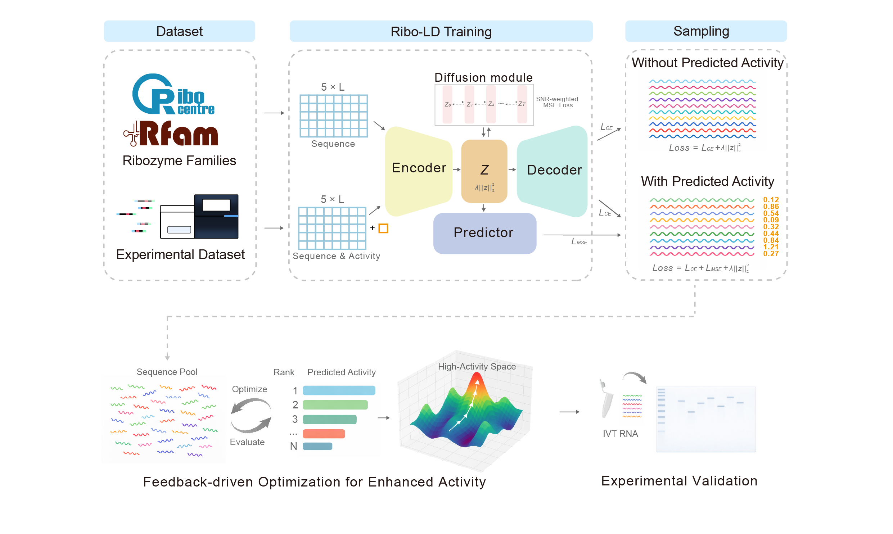

# Ribo-LD:  Feedback Latent Diffusion for Novel Functional RNA Ribozyme Generative Design

Ribo-LD is a two-stage generative framework for ribozyme design, and can be readily adapted to other functional RNA design tasks. It consists of:

1) an **autoencoder (AE)** learns a continuous latent space
2) a **1D latent diffusion model** learns the latent distribution and generates new latents, which are then **decoded** back to sequences

The repository includes both:
- **Supervised** mode: AE includes an activity regressor; diffusion can evaluate activity during training (optional dataset optimization)
- **Unsupervised** mode: AE + latent diffusion trained on unlabeled sequences (e.g., Rfam-derived)

## Overview



**(A)** Two generation modes categorized using activity labels: unsupervised (no labels used) and supervised (labels used). **(B)** Post‑processing of RNA candidates generated from the supervised mode followed by experimental validation.

## Code layout

- `Ribo-LD-supervised.py`: supervised AE + diffusion (with feedback optimization)
- `Ribo-LD-unsupervised.py`: unsupervised AE + basic diffusion
- `model/`: AE architectures
- `denoising_diffusion_pytorch/`: bundled 1D diffusion implementation
- `dataset/`: example datasets
- `src/`: convenience scripts for common runs

This repository's 1D denoising diffusion implementation is adapted from **denoising-diffusion-pytorch** :

- https://github.com/lucidrains/denoising-diffusion-pytorch


## Install

Python 3.9+ and PyTorch are recommended. Typical dependencies:

```bash
pip install numpy pandas scipy scikit-learn matplotlib seaborn tqdm einops ema-pytorch accelerate
```

## Data

All models assume sequences are **fixed length** (`seq_len`, default 200) and use 5 tokens: `A/C/G/T` plus padding `P`.

- **Supervised**: TSV with 2 columns: `sequence` and `activity`
- **Unsupervised**: text/TSV with 1 column: `sequence`

## Quick start

Run the provided scripts:

```bash
bash src/train_glmS.sh
bash src/train_LINE-1.sh
bash src/train_CPEB3.sh
bash src/train_rfam.sh
```

## Outputs

- `vae_checkpoint/`: AE checkpoints, logs, extracted latent vectors
- `diffusion_results*/`: diffusion logs, checkpoints, and samples (depending on mode)


